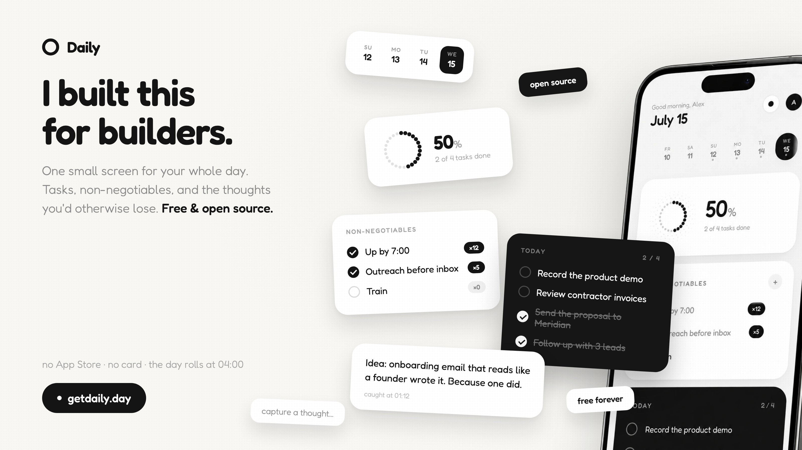

# Daily

One deliberately small screen for your whole day: today's tasks, the habits you refuse to skip, and a place to catch stray thoughts before they disappear.

Live at **[getdaily.day](https://getdaily.day)**. Free, no App Store, works on your phone and desktop.

I built this for builders.



## Why

I run my company from nine apps and a browser with forty tabs, and somewhere in that mess I kept losing the actual day. Tasks scattered everywhere, thoughts gone by the next call, and by midnight no real idea what I actually did. So I built myself a fix, then figured I'm not the only one drowning like this.

## What it does

- **Today**: a single task list for the current day. Yesterday's unfinished business doesn't silently roll over and rot.
- **Non-negotiables**: daily commitments that build streaks. Miss one and the streak says so.
- **Notes**: individual timestamped thought captures. Ideas, lines worth keeping, things you'd otherwise lose between meetings.
- **The day rolls over at 04:00**, not midnight, because your 1 a.m. push still counts as today.
- Light and dark themes, a 14-day day picker, keyboard shortcuts, and a coach-mark tour for first-timers.
- Installs to your phone's home screen as a PWA. No store, no binary, no update prompts.

## Stack

There is no backend server. The whole thing is:

- **Frontend**: static HTML, CSS, and vanilla JavaScript (ES modules). No framework, no build step.
- **Database**: [Supabase](https://supabase.com) Postgres with Row Level Security on every table.
- **Auth**: [Clerk](https://clerk.com) (Google OAuth + email with verification codes), wired to Supabase as a third-party auth provider.
- **Hosting**: any static host. We use Vercel.

Free tiers of all three run this comfortably.

## Self-hosting

### 1. Supabase

Create a project, then run [`supabase/schema.sql`](supabase/schema.sql) in the SQL editor. It creates the five tables, the RLS policies, and a trigger that seeds a starter non-negotiable for new users.

### 2. Clerk

1. Create a Clerk application with Google and Email (verification code) enabled.
2. Set the session token to carry the Supabase role claim. Via the API:

   ```bash
   curl -X PATCH https://api.clerk.com/v1/instance \
     -H "Authorization: Bearer $CLERK_SECRET_KEY" \
     -H "Content-Type: application/json" \
     -d '{"session_token_template":"{\"role\": \"authenticated\"}"}'
   ```

3. In Supabase, add Clerk as a third-party auth provider (Authentication → Sign In / Up → Third Party Auth), pointing at your Clerk frontend API domain.

### 3. Frontend

Edit the constants at the top of [`app/app.js`](app/app.js):

```js
const SB_URL   = "https://YOUR_PROJECT.supabase.co";
const SB_ANON  = "YOUR_SUPABASE_PUBLISHABLE_KEY";
const CLERK_PK = "pk_test_YOUR_CLERK_PUBLISHABLE_KEY";
```

These are all publishable keys. They are meant to ship in client code; RLS is what protects the data.

### 4. Deploy

Serve the repo root from any static host. With Vercel:

```bash
vercel --prod
```

The landing page lives at `/`, the app at `/app/`.

## Project structure

```
index.html        landing page
styles.css        shared styles (landing + app)
app/
  index.html      the app shell: auth gate, board, profile sheet, tour
  app.js          all logic: Clerk auth, Supabase data, rendering
  manifest.json   PWA manifest
assets/           product renders and screenshots
supabase/
  schema.sql      full database schema, RLS policies, seed trigger
```

## License

[MIT](LICENSE). Take it, fork it, ship your own.
